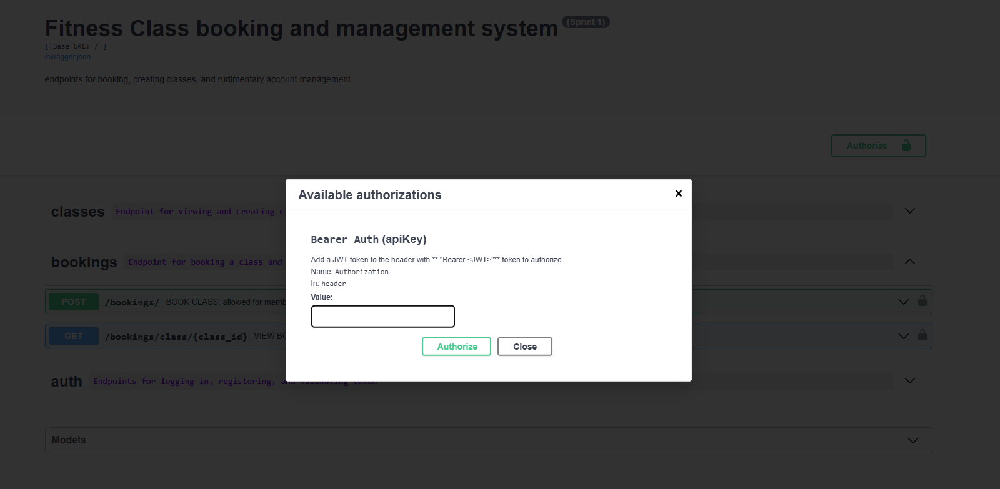

# Fitness Class Management System API

This repo contains a Flask-RESTX API foundation for the Sprint 1 Fitness Class Management System.

Current scaffolded features:

1. Create Class (trainer/admin) — endpoint template
2. View Class List (guest/member) — endpoint template
3. Book a Class (guest/member/member-only by current TODO note) — endpoint template
4. View Member/Guest List for a class (trainer/admin) — endpoint template
5. User Registration, Login, and Token Validation (guest/member/trainer/admin) — endpoint template

The current implementation is intentionally boilerplate-first and returns `501 Not Implemented` for feature endpoints while preserving API contracts and TODOs.

## Prerequisites

- python 3.10 or higher
- MongoDB installed. Follow [https://www.mongodb.com/docs/manual/installation/](https://www.mongodb.com/docs/manual/installation/)
to install MongoDB locally. Select the right link for your operating system.

## Current Project Structure

```text
.
├── app/
│   ├── __init__.py                # Flask app factory and namespace registration
│   ├── config.py                  # Environment-driven app config
│   ├── apis/
│   │   ├── __init__.py            # Shared API constants (e.g., message key)
│   │   ├── auth.py                # Feature 5 endpoints (login, register, validate token)
│   │   ├── booking.py             # Feature 3 + Feature 4 endpoints
│   │   ├── decorators.py          # Custom decorators (e.g., role-based access JWT checks)
│   │   └── fitness_class.py       # Feature 1 + Feature 2 endpoints
│   └── db/
│       ├── __init__.py            # DB client setup
│       ├── bookings.py            # Booking collection/fields
│       ├── constants.py           # Generic DB constants
│       ├── fitness_classes.py     # Fitness class collection/fields
│       ├── users.py               # User collection/role field definitions
│       └── utils.py               # Serialization helpers
├── docs/
├── reports/                       # Requirements/spec artifacts
├── tests/
│   ├── __init__.py
│   ├── unit/
│   │   ├── __init__.py
│   │   ├── conftest.py            # Pytest fixtures
│   │   ├── test_auth_api.py       # Auth endpoint tests
│   │   ├── test_booking_api.py    # Booking endpoint tests
│   │   └── test_fitness_api.py    # Fitness class endpoint tests
│   └── utils.py                   # Testing utilities
├── makefile
├── requirements.txt
└── requirements-dev.txt
```

## Tech Stack

This Flask web app uses:

- [Flask-RESTX][flask-restx] for creating REST APIs. Directory structure follows [flask restx instructions on scaling your project][flask-restx-scaling]
  - flask-restx automatically generates
  [OpenAPI specifications][openapi-specification] for your API
- [PyMongo][pymongo] for communicating with the mongodb database
- [pytest][pytest] for testing
(see [flask specific testing instructions on pytest][pytest-flask]
for more info specific to testing Flask applications)
- [mongomock][mongomock] for mocking the mongodb during unit testing

[flask-restx]: https://flask-restx.readthedocs.io/en/latest/quickstart.html
[flask-restx-scaling]: https://flask-restx.readthedocs.io/en/latest/scaling.html
[openapi-specification]: https://swagger.io/docs/specification/v3_0/about/
[pymongo]: https://pymongo.readthedocs.io/en/stable/
[pytest]: https://docs.pytest.org/en/stable/
[pytest-flask]: https://flask.palletsprojects.com/en/stable/testing/
[mongomock]: https://docs.mongoengine.org/guide/mongomock.html

## Running Locally

This assumes you are already running MongoDB (e.g., through
`brew services restart mongodb-community` on MacOS or
`sudo systemctl restart mongod` on Linux.
Find the equivalent for your OS)

### Setting up the environment

1. Check `.samplenv` file and follow the instructions there to create
your `.env` file
2. Run `make dev_env` to create a virtual environment and install dependencies

### Running the server

1. Run `make run_local_server` to run the server. This runs tests first.
2. Go to [http://127.0.0.1:8000](http://127.0.0.1:8000) to see it running!

You can use `ctrl-c` to stop the server.

### Testing the API server

Run `make tests` to execute the test suite and see the coverage report
in your terminal. You can also see a visual report by viewing
[/htmlcov/index.html](/htmlcov/index.html) in your browser.

## Current API Endpoints

Active namespaces:

- `/classes`
  - `GET /classes/` → View class list (template)
  - `POST /classes/` → Create class (template)
- `/bookings`
  - `POST /bookings/` → Book class (template)
  - `GET /bookings/class/<class_id>` → View booking list (template)
- `/auth`
  - `POST /auth/register` → Register a new user and return JWT access_token
  - `POST /auth/login` → Authenticate existing user and return JWT access_token
  - `POST /auth/validate-token` → Validate a registration invite token

## Virtual Environment (Manual)

Manually activating and deactivating the virtual environment is useful for
debugging issues and running specific scripts with flexibility (e.g., you can
run `FLASK_APP=app flask run --debug --host=0.0.0.0 --port 8000`
inside the virtual environment to directly start
the server without running tests first).

To activate the virtual environment manually:

```sh
source .venv/bin/activate
```

Alternatively, you can use:

```sh
. .venv/bin/activate
```

To deactivate the virtual environment:

```sh
deactivate
```

# Authentication and Authorization
This API uses JWT (JSON Web Tokens) to enforce role-based access control.

## Role Assignment during Registration
Roles are assigned at the time of registration (`/auth/register`) using hard-coded invite tokens:

* Include `"token": "trainer-secret-123"` in the request body to register as a `"trainer"`.
* Include `"token": "admin-secret-456"` to register as an `"admin"`.
* Omitting the token defaults the new user to a `"member"`.

## Authenticating API Requests
After registering or logging in, the API returns an `access_token`. This JWT must be included in the headers of any protected endpoint request:

* **Header name:** `Authorization`
* **Format:** `Bearer <JWT>`

**CRITICAL:** You must explicitly include the string `Bearer ` (with a trailing space) before the JWT. Omitting this prefix will result in an authorization failure.

## Using Swagger UI
To authenticate in the Swagger UI:

1. Click the **Authorize** button (top right).
2. Paste your token in the Value field using the exact format: `Bearer <your_jwt_here>`.
3. Click **Authorize**. The UI will now automatically attach this header to your protected endpoint requests.



## Best Practices

See [/docs/BestPractices.md](/docs/BestPractices.md) for advice regarding branch naming and other useful tips.
