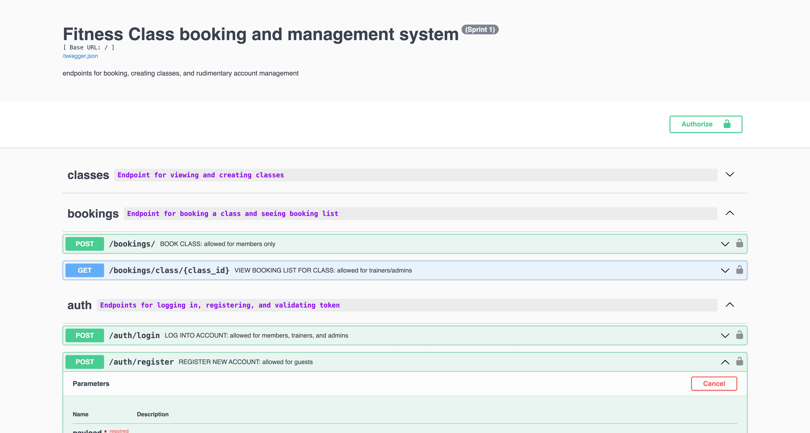

# Fitness Class Management System API

This repo contains a Flask-RESTX API foundation for the Sprint 2 Fitness Class Management System.

## Recent Updates

### 1) CI implementation (GitHub Actions)

- A CI workflow is configured and published via the repository badge at the top of this README.
- On each push/PR, the pipeline validates the project by installing dependencies and running automated checks.
- This gives quick feedback on regressions and keeps the default branch stable.

### 2) Email reminder sending with SendGrid SDK

- Reminder delivery now uses the official SendGrid Python SDK (`sendgrid`) for outbound emails.
- The reminder service builds class-based reminder content and sends one email per recipient with deterministic recipient normalization.
- Required environment variable: `SENDGRID_API_KEY`.
- Optional environment variable: `SENDGRID_FROM_EMAIL` (defaults to `noreply@coachly.dev` when not provided).

### 3) Configurable reminder notifications (Email + Telegram)

- Reminder notifications support channel-based delivery with an extensible strategy design.
- The current channels are Email and Telegram.
- Required Telegram environment variable: `TELEGRAM_BOT_TOKEN`.
- Telegram destination (`telegram_chat_id`) is stored per user through the auth preferences endpoint.

### 4) Unit testing updates

- Added/updated unit tests for the email reminder service flow in `tests/unit/test_email_reminders_service.py`.
- Tests cover message building, recipient normalization, API key validation, successful sends, rejected SendGrid statuses, and wrapped transport errors.
- Test doubles now mock SendGrid SDK client behavior for deterministic service-level tests.

Current scaffolded features:

1. Create Class (trainer/admin) — endpoint template
2. View Class List (guest/member) — endpoint template
3. Book a Class (guest/member/member-only by current TODO note) — endpoint template
4. View Member/Guest List for a class (trainer/admin) — endpoint template
5. User Registration and Login (guest/member/trainer/admin) — endpoint template
6. Send Reminder Emails (trainer) — endpoint template

The current implementation is intentionally boilerplate-first and returns `501 Not Implemented` for feature endpoints while preserving API contracts and TODOs.

## Prerequisites

- python 3.10 or higher
- MongoDB installed. Follow [https://www.mongodb.com/docs/manual/installation/](https://www.mongodb.com/docs/manual/installation/)
to install MongoDB locally. Select the right link for your operating system.

## Current Project Structure

```text
.
├── .github/
│   └── workflows/
│       └── ci.yml                # CI pipeline for automated checks on push/PR
├── app/
│   ├── __init__.py                # Flask app factory and namespace registration
│   ├── config.py                  # Environment-driven app config
│   ├── apis/
│   │   ├── __init__.py            # Shared API constants (e.g., message key)
│   │   ├── auth.py                # Feature 5 endpoints (login, register, validate token)
│   │   ├── booking.py             # Feature 3 + Feature 4 endpoints
│   │   ├── decorators.py          # Custom decorators (e.g., role-based access JWT checks)
│   │   └── fitness_class.py       # Feature 1 + Feature 2 endpoints
│   └── db/
│       ├── __init__.py            # DB client setup
│       ├── bookings.py            # Booking collection/fields
│       ├── constants.py           # Generic DB constants
│       ├── fitness_classes.py     # Fitness class collection/fields
│       ├── users.py               # User collection/role field definitions
│       └── utils.py               # Serialization helpers
│   └── services/
│       ├── __init__.py
│       └── email_reminders.py     # SendGrid-based reminder email orchestration
├── docs/
├── reports/                       # Requirements/spec artifacts
├── tests/
│   ├── __init__.py
│   ├── unit/
│   │   ├── __init__.py
│   │   ├── conftest.py            # Pytest fixtures
│   │   ├── test_auth_api.py       # Auth endpoint tests
│   │   ├── test_booking_api.py    # Booking endpoint tests
│   │   ├── test_email_reminders_service.py  # Email reminder service unit tests
│   │   ├── test_fitness_api.py    # Fitness class endpoint tests
│   │   └── test_general.py        # General API sanity and behavior tests
│   └── utils.py                   # Testing utilities
├── makefile
├── requirements.txt
└── requirements-dev.txt
```

## Tech Stack

This Flask web app uses:

- [Flask-RESTX][flask-restx] for creating REST APIs. Directory structure follows [flask restx instructions on scaling your project][flask-restx-scaling]
  - flask-restx automatically generates
  [OpenAPI specifications][openapi-specification] for your API
- [PyMongo][pymongo] for communicating with the mongodb database
- [pytest][pytest] for testing
(see [flask specific testing instructions on pytest][pytest-flask]
for more info specific to testing Flask applications)
- [mongomock][mongomock] for mocking the mongodb during unit testing
- [SendGrid Python SDK][sendgrid-sdk] for reminder email delivery
- [requests][requests-docs] for HTTP client integrations/utilities
- [pytest-mock][pytest-mock] for clean mocking patterns in unit tests
- [pytest-cov][pytest-cov] for coverage reporting
- [GitHub Actions][gha] for CI automation

[flask-restx]: https://flask-restx.readthedocs.io/en/latest/quickstart.html
[flask-restx-scaling]: https://flask-restx.readthedocs.io/en/latest/scaling.html
[openapi-specification]: https://swagger.io/docs/specification/v3_0/about/
[pymongo]: https://pymongo.readthedocs.io/en/stable/
[pytest]: https://docs.pytest.org/en/stable/
[pytest-flask]: https://flask.palletsprojects.com/en/stable/testing/
[mongomock]: https://docs.mongoengine.org/guide/mongomock.html
[sendgrid-sdk]: https://github.com/sendgrid/sendgrid-python
[requests-docs]: https://requests.readthedocs.io/en/latest/
[pytest-mock]: https://pytest-mock.readthedocs.io/
[pytest-cov]: https://pytest-cov.readthedocs.io/
[gha]: https://docs.github.com/actions

## Running Locally

This assumes you are already running MongoDB (e.g., through
`brew services restart mongodb-community` on MacOS or
`sudo systemctl restart mongod` on Linux.
Find the equivalent for your OS)

### Setting up the environment

1. Check `.envexample` file and follow the instructions there to create
your `.env` file
2. Run `make dev_env` to create a virtual environment and install dependencies

### Running the server

1. Run `make run_local_server` to run the server. This runs tests first.
2. Go to [http://127.0.0.1:8000](http://127.0.0.1:8000) to see it running!

You can use `ctrl-c` to stop the server.

### Testing the API server

Run `make tests` to execute the test suite and see the coverage report
in your terminal. You can also see a visual report by viewing
[/htmlcov/index.html](/htmlcov/index.html) in your browser.

For targeted unit testing during development, you can run specific files such as:

- `pytest tests/unit/test_email_reminders_service.py -q`

## Current API Endpoints

Active namespaces:

- `/classes`
  - `GET /classes/` → View class list (template)
  - `POST /classes/` → Create class (template)
  - `POST /classes/<class_id>/reminders` → Send reminder notifications to class attendees (template)
- `/bookings`
  - `POST /bookings/` → Book class (template)
  - `GET /bookings/class/<class_id>` → View booking list (template)
- `/auth`
  - `POST /auth/register` → Register a new user and return JWT access_token
  - `POST /auth/login` → Authenticate existing user and return JWT access_token
  - `POST /auth/validate-token` → Validate a registration invite token
  - `POST /auth/notification-preferences` → Update user notification preferences and telegram_chat_id

## Sending Telegram Reminders

To deliver class reminders through Telegram, complete all of the following:

1. Set `TELEGRAM_BOT_TOKEN` in your `.env`.
2. Ensure the target user has a valid `telegram_chat_id` and Telegram notifications enabled.
3. Create/book a future class for that user.
4. Trigger `POST /classes/<class_id>/reminders` using a trainer JWT.

Example preference update (authenticated as the target user):

```json
{
  "notification_preferences": {
    "email": false,
    "telegram": true
  },
  "telegram_chat_id": "123456789"
}
```

Notes:
- The API calls Telegram Bot API `sendMessage` under the hood.
- If `TELEGRAM_BOT_TOKEN` is missing or invalid, reminder sending will fail at dispatch time.
- The user must have started a chat with your bot so the `telegram_chat_id` is reachable.

## Virtual Environment (Manual)

Manually activating and deactivating the virtual environment is useful for
debugging issues and running specific scripts with flexibility (e.g., you can
run `FLASK_APP=app flask run --debug --host=0.0.0.0 --port 8000`
inside the virtual environment to directly start
the server without running tests first).

To activate the virtual environment manually:

```sh
source .venv/bin/activate
```

Alternatively, you can use:

```sh
. .venv/bin/activate
```

To deactivate the virtual environment:

```sh
deactivate
```

# Authentication and Authorization
This API uses JWT (JSON Web Tokens) to enforce role-based access control.

## Role Assignment during Registration
Roles are assigned at the time of registration (`/auth/register`) using hard-coded invite tokens:

* Include `"token": "trainer-secret-123"` in the request body to register as a `"trainer"`.
* Include `"token": "admin-secret-456"` to register as an `"admin"`.
* Omitting the token defaults the new user to a `"member"`.

## Authenticating API Requests
After registering or logging in, the API returns an `access_token`. This JWT must be included in the headers of any protected endpoint request:

* **Header name:** `Authorization`
* **Format:** `Bearer <JWT>`

**CRITICAL:** You must explicitly include the string `Bearer ` (with a trailing space) before the JWT. Omitting this prefix will result in an authorization failure.

## Using Swagger UI
To authenticate in the Swagger UI:

1. Click the **Authorize** button (top right).
2. Paste your token in the Value field using the exact format: `Bearer <your_jwt_here>`.
3. Click **Authorize**. The UI will now automatically attach this header to your protected endpoint requests.

