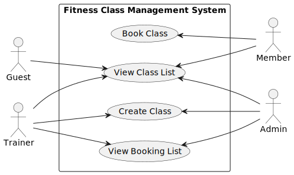

# Requirements Specification

---

# Actors

Based on the meeting, the system has the following actors:

* **Guest**
* **Member**
* **Trainer**
* **Admin**

### Role Clarifications

* Everybody (Guests, Members, Trainers, Admins) can view the class list.
* Members can book classes. Guests can view classes but must register to book.
* Trainers can create classes.
* Admins have the same permissions as Trainers.
* Admin accounts are created via a token mechanism.
* Role-based authentication is enforced for restricted endpoints via JWT claims.

---

# Use Case Diagram

## Textual Representation

Actors and Use Cases:

* Guest → View Class List, Register
* Member → login, View Class List, Book Class
* Trainer → login, View Class List, Create Class, View Booking List, Send Email Reminder
* Admin → login, View Class List, Create Class, View Booking List

## Diagram

---

# Use Case 1: Create Class

## Use Case Name

Create Fitness Class

## Primary Actor

Trainer (Admin has same permissions)

## Preconditions

* User is authenticated with a valid JWT.
* User has role Trainer or Admin.
* Required class information is provided.

## Main Success Scenario

1. Actor sends a request (`POST /classes/`) to create a new class, providing all required information in the payload (name, description, date/time, duration, capacity, location).
2. System verifies the user's JWT `access_token` and role permissions.
3. System validates the input fields (e.g., ensures capacity is a positive integer, date/time is in the future, no missing fields).
4. System stores the new class entity in the database.
5. System returns a `201 Created` confirmation along with the newly generated class ID and details.

## Alternative Flows

* **Missing Required Fields:**
  System returns 400 Bad Request.

* **Unauthorized User:**
  System returns 403 Forbidden.

## Postconditions

* New class is stored in the system.
* Class is visible in the class list.
* The class is available for members to book.

---

# Use Case 2: View Class List

## Use Case Name

View Class List

## Primary Actor

Guest, Member

## Preconditions

* None

## Main Success Scenario

1. Actor requests the list of all available fitness classes (`GET /classes/`).
2. System retrieves the list of upcoming classes from the database.
3. System returns a `200 OK` response containing a list of class objects, detailing:
   * Class name
   * Date/time
   * Capacity
   * Available spots
   * Trainer name

## Alternative Flows

* **No Classes Available:**
  System returns empty list.

## Postconditions

* Actor receives accurate list of classes.

---

# Use Case 3: Book Class

## Use Case Name

Book Fitness Class

## Primary Actor

Member

## Preconditions

* User is authenticated with a valid JWT.
* User has the `"member"` role.
* The target class exists and has available capacity (`available spots > 0`).
* User has not already booked this specific class.

## Main Success Scenario

1. Actor selects a specific class and sends a booking request (`POST /bookings/`).
2. System verifies the user's JWT `access_token` for authentication.
3. System checks the database to confirm the class exists and the user hasn't already booked it.
4. System verifies the class has available capacity.
5. System creates a booking record linking the user to the class.
6. System decrements the available capacity of the class by 1.
7. System returns a `201 Created` confirmation of the successful booking.

## Alternative Flows

* **Class Full:**
  System returns error message.

* **Duplicate Booking Attempt:**
  System rejects duplicate booking.

* **Class Does Not Exist:**
  System returns 404 Not Found.

## Postconditions

* Booking is stored.
* Capacity is updated.
* The system updates the user’s booking records to include the selected class.
---

# Use Case 4: View Member/Guest List

## Use Case Name

View Booking List for a Class

## Primary Actor

Trainer, Admin

## Preconditions

* User is authenticated with a valid JWT.
* User has `"trainer"` or `"admin"` role.
* The specific class exists in the system.

## Main Success Scenario

1. Actor requests the list of attendees for a specific class ID (`GET /bookings/class/<class_id>`).
2. System verifies the user's JWT `access_token` and confirms their elevated role.
3. System verifies the requested class exists.
4. System retrieves the list of all users who have successfully booked the class.
5. System returns a `200 OK` response with an array of attendee details including:

   * User name
   * User type (Member)
   * Booking timestamp

## Alternative Flows

* **Unauthorized Access:**
  System returns 403 Forbidden.

* **Class Not Found:**
  System returns 404 Not Found.

## Postconditions

* Trainer/Admin can view accurate booking list.

---

# Use Case 5: Register User (`/auth/register`)

## Use Case Name

Create a new account and return access token

## Primary Actor

Guest

## Preconditions

* User is not currently authenticated.

## Main Success Scenarios

1. Actor submits a registration request containing their details (Name, Email, Phone, Password) and, optionally, an invite `token`.
2. System validates that the provided email and phone number do not already exist in the system.
3. System verifies the presence and validity of the invite `token` to determine the user's role:
   * If the `token` is omitted, the System assigns the role `"member"`.
   * If the `token` matches the trainer secret, the System assigns the role `"trainer"`.
   * If the `token` matches the admin secret, the System assigns the role `"admin"`.
4. System creates the new account in the database with the assigned role.
5. System generates a JWT `access_token` for the newly created user.
6. System returns a `201 Created` response containing the JWT `access_token`.

## Alternative Flows

* **Invalid Invite Token:**
  System returns `403 Forbidden` ("Invalid or expired token") if a token is provided but is not in `VALID_TOKENS`.
* **Duplicate Email or Phone:**
  System returns a `409 Conflict` indicating the email or phone is already in use.

## Postconditions

* A new account is created, and the user is instantly logged in (JWT issued).

---

# Use Case 6: Login User (`/auth/login`)

## Use Case Name

Authenticate an existing account

## Primary Actor

Guest, Member, Trainer, Admin

## Preconditions

* User has a registered account.

## Main Success Scenario

1. Actor provides credentials (email and password).
2. System validates credentials.
3. System generates and returns a JWT `access_token`. (The JWT includes role and user_id claims).

## Alternative Flows

* **Missing Email or Password:**
  System returns `400 Bad Request`.
* **Phone Login Attempted:**
  If the request includes a phone field, the system returns `400 Bad Request` ("phone login is not supported; use email").
* **User Not Found:**
  System returns `404 Not Found`.
* **Wrong Password:**
  System returns `400 Bad Request`.

## Postconditions

* Actor receives a JWT token to use as a Bearer token for protected endpoints.

---

# Use Case 8: Send Email Reminder

## Use Case Name

Send Reminder Emails to those who signed up for a class

## Primary Actor

Trainer

## Preconditions

* User is authenticated.
* User has Trainer role.
* The attending class exists.
* There are members who signed up for the class
* The time is before the class has started 

## Main Success Scenario

1. Actor requests to send a reminder email for a specific scheduled class.
2. System verifies the user's permissions.
3. System retrieves the list of members who have booked the class.
4. System drafts and dispatches the reminder email to all attendees on the retrieved list.
5. System returns a success confirmation to the actor indicating the emails were successfully sent.

## Alternative Flows

* **Unauthorized Access:**
  System returns 403 Forbidden.
* **Class Not Found:**
  System returns 404 Not Found.
* **Class Already Occurred:**
  System returns an error indicating that reminders can only be sent before a class takes place.
* **No Attendees Booked:**
  System returns a message indicating no emails were sent because the booking list is empty.

## Postconditions

* Reminder emails are successfully sent to all registered members for the specified class.

---

# Authentication and Authorization

## Auth flow (hard-coded invite tokens vs JWT)

### 1: Hard-coded tokens (registration invite tokens)
We have hard-coded **invite tokens** in the backend configuration (`app/apis/auth.py`):
- `"trainer-secret-123"` → registers the user with role `"trainer"`
- `"admin-secret-456"` → registers the user with role `"admin"`

These tokens are only used during **registration** (`POST /auth/register`):
- If the request body includes `"token": "<one of the valid tokens>"`, the backend assigns the matching elevated role.
- If the request body omits `"token"`, the backend defaults the new user’s role to `"member"`.
- These invite tokens are **not** used as authentication for normal API calls. they just decide the role at sign-up time.

### 2: JWT (actual auth token used for protected endpoints)
After a user is registered or logs in, the backend issues a **JWT access token**:
- `POST /auth/register` returns an `access_token` immediately after creating the account.
- `POST /auth/login` returns an `access_token` after validating email + password.

This JWT is what you use to authenticate to protected endpoints. The API checks it from the HTTP header:
- **Header name:** `Authorization`
- **Format:** `Bearer <JWT>`

Role-based access is enforced using the JWT’s `"role"` claim (e.g., calling `verify_jwt_in_request()` and checking `get_jwt()["role"]`).

### 3 Swagger / OpenAPI: how to authorize

In Swagger UI:
1. Click the **Authorize** button (top right).
2. Paste the value in this exact format:
   `Bearer <JWT>`

After that, Swagger will send `Authorization: Bearer <JWT>` on requests, and the backend will treat you as the logged-in user with that role. Failure to include the `Bearer ` prefix will result in authorization failure.
