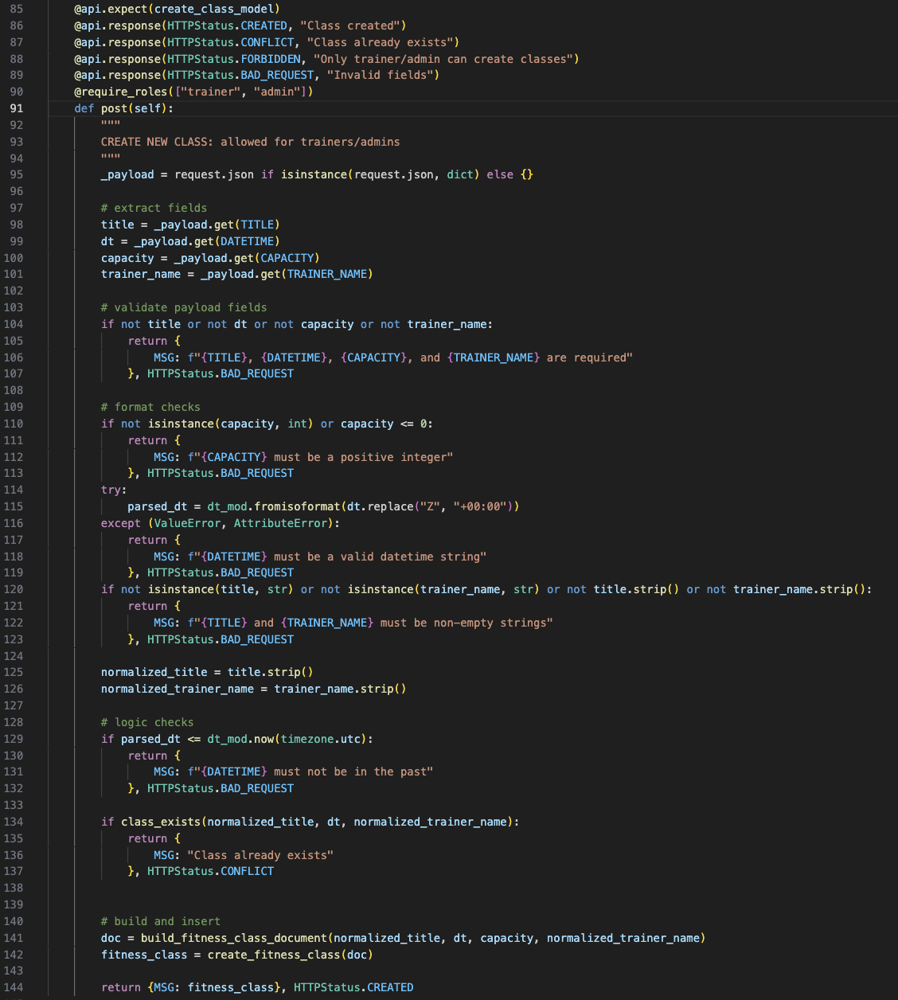
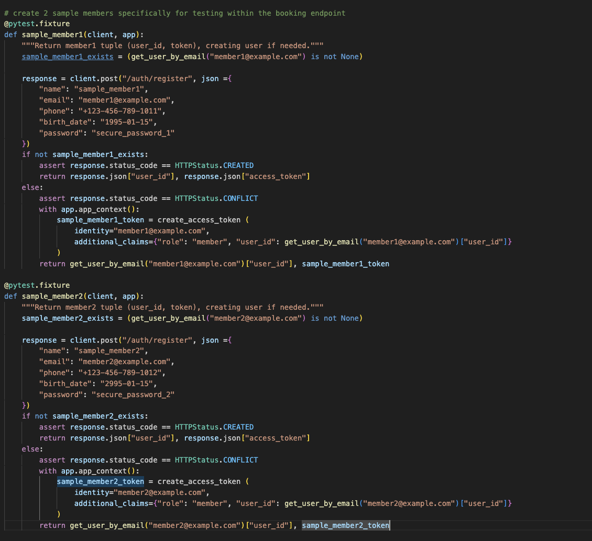
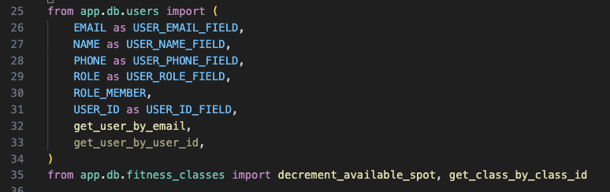
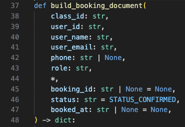
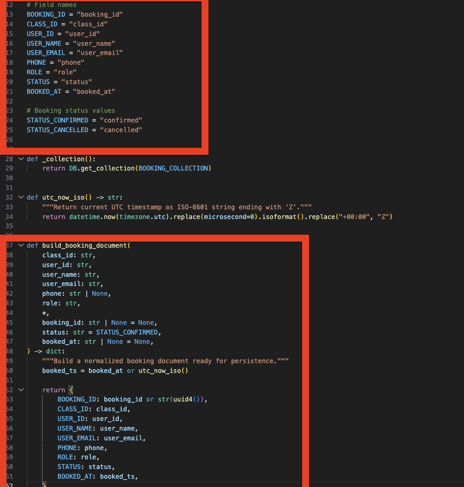

# Design Reflection — Sprint 3A

---

## Executive Summary

To ensure our UML diagrams accurately reflected the system architecture while remaining accessible for technical documentation we adopted a hybrid approach utilizing automated reverse engineering tools followed by manual refinement. For the class diagram we used pyreverse to extract foundational class dependencies from the python codebase and then imported the resulting .dot file into GraphvizOnline to manually clean up dependency edges and logically group our API, Service, and Database layers. Similarly for the sequence diagram we leveraged the PyReverseSequence plugin in VSCode to trace the exact python call stack into base Mermaid syntax. We then ported these raw fragments into the Mermaid Web Editor where we manually injected necessary HTTP boundaries, Client actors, and critical validation gates (such as break and alt blocks) to accurately capture the system's error handling and external service integrations.

| Team Member | Responsibilities |
|-------------|-----------------|
| [Tianze]    | Task 1 creating and explain in depth the class diagrams and sequence diagrams and detailing the executive summary |
| [Juan Diego]      | Task 3 Identify Code Smells in Your Source Code and Tests |
| [Name]      | e.g., Task 4 reflection, report formatting, review |

---

## Task 1: Design Diagrams

### 1.1 Class Diagram

**Notes and descriptions with key design decisions:**
> This class digram shows the API resources (such as BookingResource and ClassReminderResource) act as controllers that depend on pure function calls (like create_booking()) from the database modules (users, fitness_classes, bookings) rather than using a traditional Object-Oriented ORM. The core data models share standard 1 to 0..n associations, indicating that the independent user and fitness class collections are linked to multiple individual bookings via ID references rather than nested composition. A notable design choice is the decoupling of external integrations instead of sending emails directly the ClassReminderResource delegates the attendee data to the EmailReminderService, which independently manages the external HTTP calls to the SendGridAPI ensuring the core API routing logic remains safely isolated from third-party network dependencies.

---

### 1.2 Sequence Diagram — Book a Class Endpoint

**Notes and descriptions:**
> The sequence diagram illustrates the end-to-end execution flow for booking a fitness class, triggered when a Client sends a POST request to the API. The process begins with JWT authentication and proceeds through a series of strict validation gates which clearly modeled using break fragments and will immediately return HTTP error codes (403, 404, 400) if the user identity mismatches, entities are missing, the user lacks member privileges, or a duplicate booking is found. Once these guardrails are cleared, the API constructs the booking document and executes a noteworthy concurrency safe atomic database update to decrement the class's available spots, returning a 409 Conflict if the class is already full. This ensures that the final MongoDB insertion step only occurs when all business rules and capacity constraints are definitively satisfied, ultimately culminating in a 201 Created success response to the Client.

---

### 1.3 Sequence Diagram — Send Reminders Endpoint

**Notes and descriptions:**
> This sequence diagram outlines the execution path for a trainer initiating class reminders starting with role based authorization and proceeding through sequential database queries to fetch class details and attendee bookings. this flow will trigger break fragments that immediately halt execution and return HTTP errors if the class is missing, scheduled in the past, or lacks attendees. Once the data is validated and deduplicated the API deliberately delegates the notification logic to a dedicated email service layer. This will have the service construct the message and loop through unique recipients to dispatch external requests to the SendGrid API. Furthermore the diagram uses a final alt block to ensure that if the external SendGrid network call fails, the system safely catches the exception and returns a 502 Bad Gateway rather than crashing the application.

---

## Task 2: Design Principle Violations

> _Identify **five** places in your code where OO design principles (Abstraction, Encapsulation, Modularity, Hierarchy) or SOLID principles are violated. Aim for at least **three distinct principles**. For each violation, provide: the principle, file name, line numbers, method name, a screenshot, and a clear explanation._

---

### Violation 1 — Single Responsibility & Modularity in `Register.post`

**Principle(s):** Single Responsibility Principle (SRP), Modularity / Separation of Concerns  
**File:** `app/apis/auth.py`  
**Lines (approx.):** 60–130  
**Method/Class:** `Register.post` (class `Register`)

**Screenshot:**  
> Insert a screenshot of the `Register.post` method in `app/apis/auth.py`, showing the full body of the method and its imports for `bcrypt`, `create_access_token`, and the DB helper functions.

**Explanation:**  
`Register.post` currently handles four distinct responsibilities at once: (1) HTTP concerns such as reading the JSON payload and returning Flask/RESTX responses; (2) business rules for checking duplicate users by email and phone; (3) security concerns for hashing passwords with bcrypt; and (4) persistence and token issuing by building a user document, inserting it into the DB, and generating a JWT access token. Because changes to any of these concerns (password policy, uniqueness rules, response format, persistence details) all require modifying this same method, it violates the Single Responsibility Principle and weakens modularity. A better design would extract a dedicated application/service function such as `register_user(data)` into a service module (e.g., `app/services/auth_service.py`) and let the Flask resource focus only on mapping HTTP requests/responses around that service.

---

### Violation 2 — Open–Closed & Tight Coupling in Hard-Coded Invite Tokens

**Principle(s):** Open–Closed Principle (OCP), Tight Coupling / Information Hiding  
**File:** `app/apis/auth.py`  
**Lines (approx.):** 15–60  
**Method/Class:** Global `VALID_TOKENS` and function `validate_token`

**Screenshot:**  
> Insert a screenshot that includes the `VALID_TOKENS` dictionary and the `validate_token` decorator implementation in `app/apis/auth.py`.

**Explanation:**  
The registration invite tokens are hard-coded in a global `VALID_TOKENS` dictionary within the API module, and the `validate_token` decorator directly reads from this dictionary to determine the user role. In practice, that means any change to token behavior—such as adding new tokens, changing roles, or moving tokens into a database—requires editing this API file, which goes against the Open–Closed Principle. It also creates tight coupling: the API layer knows the exact tokens and how roles are derived from them, instead of relying on a hidden implementation behind a cleaner interface. A more extensible and loosely coupled design would introduce an abstraction like `resolve_registration_role(token: str) -> str | None` in a separate service module, so the API depends on a role-resolution API rather than a specific in-memory dictionary.

---

### Violation 3 — Separation of Concerns in API-to-DB Coupling

**Principle(s):** Separation of Concerns (SoC), Layered Architecture  
**Files:**  
	- `app/apis/booking.py` (class `BookingResource`, method `post`, approx. lines 40–130)  
	- `app/apis/fitness_class.py` (class `ClassListResource`, method `post`, approx. lines 60–150)

**Screenshot:**  
> Insert screenshots showing `BookingResource.post` in `app/apis/booking.py` (where it calls DB functions like `get_user_by_email`, `booking_exists_for_user`, `get_class_by_class_id`, `decrement_available_spot`, and `create_booking`), and `ClassListResource.post` in `app/apis/fitness_class.py` (where it calls `class_exists`, `build_fitness_class_document`, and `create_fitness_class`).

**Explanation:**  
Both the booking and class creation endpoints depend directly on low-level database helpers. For example, `BookingResource.post` calls persistence functions like `get_user_by_email`, `booking_exists_for_user`, and `decrement_available_spot`, while `ClassListResource.post` calls `class_exists` and `create_fitness_class`. In other words, the web controllers are reaching straight into the data layer instead of going through a clear application/service layer, which blurs the separation of concerns and weakens the idea of a layered architecture. Introducing a booking/class service (for example, `BookingService.book_class(user, class_id)` or `ClassService.create_class(...)`) would keep controller logic focused on HTTP concerns while the service layer owns the orchestration of DB operations, making the overall design easier to test, reason about, and extend.

---

### Violation 4 — Immutability & Side Effects in `serialize_item`

**Principle(s):** Immutability, Side Effects / Functional Purity  
**File:** `app/db/utils.py`  
**Lines (approx.):** 15–45  
**Method/Class:** Function `serialize_item`

**Screenshot:**  
> Insert a screenshot showing the implementation of `serialize_item` (and optionally `serialize_items`) in `app/db/utils.py`.

**Explanation:**  
The `serialize_item` function is intended to convert a MongoDB document into a serialized form by turning the `_id` field into a string. However, it mutates the passed-in dictionary in place (`item[ID] = serialize_oid(item[ID])`) and then returns the same object. That side effect can be surprising: callers may still rely on the original `ObjectId` type and might not expect that simply “formatting” an item changes the underlying data structure they hold. From an immutability/functional-purity perspective, it is usually cleaner for a helper like this to return a new, serialized copy of the data (for example `{**item, ID: serialize_oid(item[ID])}`) and leave the original input untouched, which makes the behavior easier to reason about and safer to reuse.

---

### Violation 5 — Improper Exception Handling in Global Catch-All Exception Handler

**Principle(s):** Improper Exception Handling (Catch-All Anti-Pattern), Separation of Concerns  
**File:** `app/__init__.py`  
**Lines (approx.):** 35–80  
**Method/Class:** Nested function `handle_input_validation_error` with `@api.errorhandler(Exception)` inside `create_app`

**Screenshot:**  
> Insert a screenshot from `app/__init__.py` that includes the `create_app` function and the nested `handle_input_validation_error` registered via `@api.errorhandler(Exception)`.

**Explanation:**  
The global error handler in `create_app` is registered for the base `Exception` type and maps every exception in the system to a generic HTTP 500 response with `{"message": str(error)}`. In effect, this is a classic catch-all anti-pattern: domain errors, validation errors, infrastructure failures, and even programming bugs are all treated identically, so you lose the ability to respond differently to different classes of failure. It also adds another concern into `create_app`, which is already busy with configuration, JWT setup, DB initialization, and namespace registration. A cleaner approach would define a few focused exception types (for example `DomainError`, `AuthorizationError`, `InfrastructureError`) and register specific handlers for each, while keeping a final generic handler only as a true last resort. That keeps error-handling logic better separated from app wiring and makes the behavior of failures much more intentional and understandable.

---

## Task 3: Code Smells

> _Identify at least **five distinct code smell types** in your source code and/or tests. For each, state the smell, the file/line numbers/method name, and include a screenshot._

---

### Code Smell 1 — Long Method

**Smell:** Long Method, God Class  
**File:** `app/apis/fitness_class.py`  
**Lines:** 91-144  
**Method/Class:** `ClassListResource.post()`

**Screenshot:**

**Explanation:**
> The `post()` method handles many responsibilities in one place: payload extraction, validation, datetime parsing, business rule checks (past date and duplicates), response construction, and persistence. This increases cognitive load and makes future feature additions (e.g., recurring classes) harder to implement safely.

---

### Code Smell 2 — Duplicate Code

**Smell:** Duplicate Code  
**File:** `tests/unit/test_booking_api.py`  
**Lines:** 36-57 and 60-81  
**Method/Class:** `sample_member1()` and `sample_member2()` fixtures

**Screenshot:**

**Explanation:**
> Both fixtures repeat almost the same registration and token fallback logic with only small literal changes (email/phone/password/name). This duplication makes test maintenance harder and increases the chance of inconsistent behavior when the auth flow changes.

---

### Code Smell 3 — Dead Code (Unused Import)

**Smell:** Dead Code / Unused Import  
**File:** `app/apis/booking.py`  
**Lines:** 25-34 (specifically line 33)  
**Method/Class:** module-level imports

**Screenshot:**

**Explanation:**
> `get_user_by_user_id` is imported but never used in this module. Unused imports are a maintainability smell because they add noise, can mislead readers about dependencies, and often indicate leftover code from previous refactors.

---

### Code Smell 4 — Long Parameter List

**Smell:** Long Parameter List  
**File:** `app/db/bookings.py`  
**Lines:** 37-48  
**Method/Class:** `build_booking_document()`

**Screenshot:**

**Explanation:**
> `build_booking_document()` takes many primitive parameters (`class_id`, `user_id`, `user_name`, `user_email`, `phone`, `role`, plus optional fields). This is a long parameter list smell because it increases call-site complexity and makes argument ordering/consistency errors more likely as the booking model evolves.

---

### Code Smell 5 — Primitive Obsession

**Smell:** Primitive Obsession  
**File:** `app/db/bookings.py`  
**Lines:** 13-25 and 37-62  
**Method/Class:** `build_booking_document()`

**Screenshot:**

**Explanation:**
> Booking domain concepts are represented as raw primitives (multiple strings for `role`, `status`, `user_email`, `class_id`, etc.) instead of richer domain types or value objects. This makes invalid states easier to pass around and spreads format/validation concerns across the codebase.

---

## Task 4: Reflection on New Features

> _Reflect on how your current design will **help or hinder** the implementation of the two new features below, with particular attention to **maintainability** and **extensibility**._

### New Features

- **Feature 6 — Create Recurring Class:** As a trainer, I want to create recurring classes (e.g., daily or monthly) so that I don't have to manually re-enter the same class multiple times.
- **Feature 7 — Configure Notifications:** As someone registered in a class, I want to choose how I receive reminders (e.g., email and/or Telegram and/or SMS) so I can stay informed in the ways that suit me.

---

### 4.1 Feature 6 — Create Recurring Class

**How does the current design help?**
> _[Describe any existing abstractions, patterns, or structures that would make this easier to implement.]_

**How does the current design hinder?**
> _[Reference specific violations or smells from Tasks 2 & 3 that would make this harder. Discuss maintainability/extensibility concerns.]_

**Initial thoughts on approach:**
> _[High-level thoughts on how you might redesign or extend the system to support this feature cleanly — no implementation required.]_

---

### 4.2 Feature 7 — Configure Notifications

**How does the current design help?**
> _[Describe any existing abstractions, patterns, or structures that would make this easier to implement.]_

**How does the current design hinder?**
> _[Reference specific violations or smells from Tasks 2 & 3 that would make this harder. Discuss maintainability/extensibility concerns.]_

**Initial thoughts on approach:**
> _[High-level thoughts on how you might redesign or extend the system to support this feature cleanly — no implementation required.]_

---

### 4.3 Summary

> _Provide a brief overall summary of the team's key takeaways from this design analysis sprint, and what you would prioritise fixing before implementing the new features._