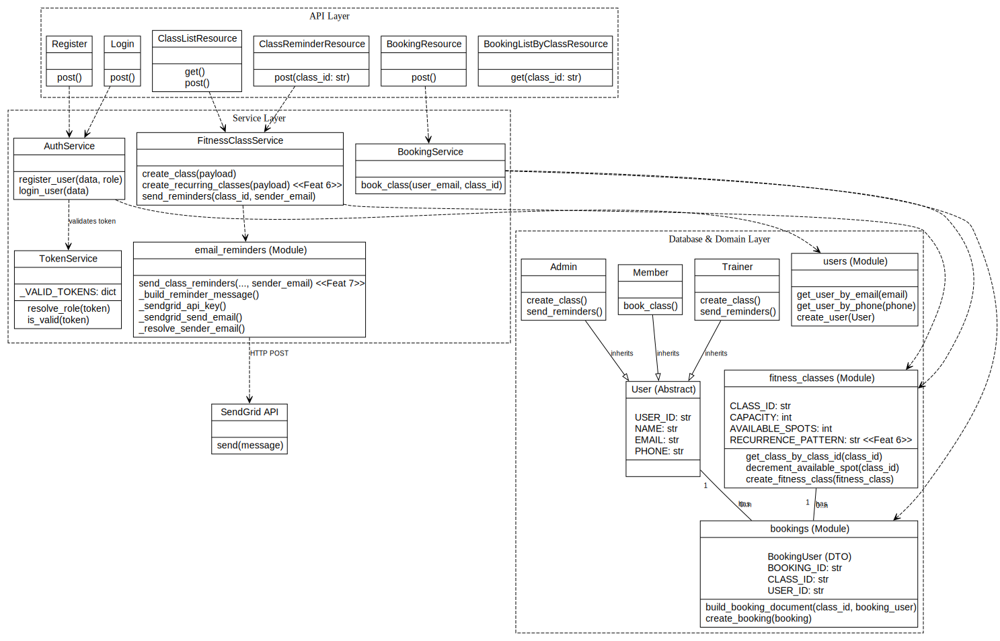

# Redesign Report — Sprint 3B

## Team Responsibilities

Each member was responsible for specific tasks during Sprint 3B, while maintaining a shared understanding of the overall system redesign and construction:

- Tianze
  - Task 5: Diagrams and Documentation (Updated the class diagrams, authored the redesign.md document, and updated README/Swagger docs).
  - Task 4: Ensured Continuous Integration (CI) worked correctly (Push/PR triggers, secrets configuration, passing workflows).

- Juan
  - Task 2: Implemented new features, acting as the lead for Feature 7 (Configurable Notifications via Email + Telegram using an extensible design).
  - Task 1: Redesign and Refactor (Owned the backend/domain refactoring execution).

- Vladimir
  - ⁠Task 3: Update and add new tests (maintain 95% coverage)
  - ⁠Task 2: Implement new features, Feature 6 lead (Recurring Classes)

## 1. Scope and Goal

Sprint 3B focuses on three outcomes:
- remove Sprint 3A design principle violations and code smells,
- redesign the architecture for extensibility,
- prepare the codebase for recurring classes and configurable notifications.

## 2. New Structure After Refactor

The backend now follows a clearer layered model:
- API layer: request/response mapping only.
- Service layer: business logic and orchestration.
- DB layer: persistence and document operations.
- Exception layer: typed app/domain errors mapped to HTTP responses.

Main structural changes:
- Added service modules for auth, booking, fitness class, and token resolution.
- Added centralized exception hierarchy and explicit error handlers.
- Converted controllers to thin resources that delegate work to services.
- Removed in-place mutation in serialization helper.

## 3. Task 1: Refactoring Design Principles and Code Smells

Below is the violation/smell closure summary with the new structure used to remove each issue.

### 1. Fixed Single Responsibility Principle in Register.post

- Before: Register.post in app/apis/auth.py performed payload validation, duplicate checks, password hashing, user creation, and response composition in one endpoint method.
- What we changed: moved domain logic into AuthService.register_user and kept Register.post as a thin HTTP mapper.
- After: registration business rules live in app/services/auth_service.py, while app/apis/auth.py handles request parsing and token response only.
- Code references: app/apis/auth.py, app/services/auth_service.py.

### 2. Fixed Open-Closed Principle in invite token handling

- Before: token-role mapping and validation were hard-coded directly in app/apis/auth.py.
- What we changed: introduced TokenService as the token resolution abstraction.
- After: validate_token in app/apis/auth.py delegates to TokenService.resolve_role and TokenService.is_valid, so token backend changes do not require controller rewrites.
- Code references: app/apis/auth.py, app/services/token_service.py.

### 3. Fixed API-to-DB coupling (Separation of Concerns)

- Before: BookingResource.post and ClassListResource.post orchestrated DB calls directly (existence checks, business rules, and persistence order) inside API resources.
- What we changed: extracted flow logic into BookingService.book_class and FitnessClassService.create_class/send_reminders.
- After: API resources in app/apis/booking.py and app/apis/fitness_class.py delegate business operations to services and only map HTTP status/payload.
- Code references: app/apis/booking.py, app/services/booking_service.py, app/apis/fitness_class.py, app/services/fitness_class_service.py.

### 4. Fixed side effects in serialization helper

- Before: serialize_item in app/db/utils.py modified the input dictionary in place by replacing _id.
- What we changed: rewrote serialize_item to return a new dictionary with a serialized ID.
- After: serialization is now functional and side-effect free for callers.
- Code references: app/db/utils.py.

### 5. Fixed catch-all exception anti-pattern

- Before: app/__init__.py had a single broad Exception handler that collapsed unrelated failures into generic 500 responses.
- What we changed: added typed application exceptions and explicit handlers.
- After: AppError subclasses (validation/not-found/domain/infrastructure) are mapped intentionally, while unexpected exceptions still fall back to sanitized 500.
- Code references: app/exceptions.py, app/__init__.py.

### 6. Fixed long-method smell in class creation endpoint

- Before: ClassListResource.post in app/apis/fitness_class.py included field validation, datetime parsing, business rules, and persistence orchestration.
- What we changed: moved these steps into FitnessClassService.create_class.
- After: class creation endpoint is short and focused, reducing controller complexity and improving unit-test granularity.
- Code references: app/apis/fitness_class.py, app/services/fitness_class_service.py.

### 7. Fixed duplicate-code smell in booking tests

- Before: sample_member1 and sample_member2 fixtures repeated almost identical register-or-token fallback logic.
- What we changed: extracted common setup into _register_or_get_member.
- After: both fixtures reuse one helper, reducing drift risk and test maintenance overhead.
- Code references: tests/unit/test_booking_api.py.

### 8. Fixed dead-code/unused-import smell

- Before: app/apis/booking.py carried imports that were no longer used by endpoint code.
- What we changed: removed unused symbols during the service extraction pass.
- After: module dependencies are cleaner and imports now reflect actual usage.
- Code references: app/apis/booking.py.

### 9. Fixed long-parameter-list smell in booking document construction

- Before: build_booking_document in app/db/bookings.py required many primitive arguments (class/user/role/contact fields), making call sites verbose and fragile.
- What we changed: introduced BookingUser dataclass and changed builder signature to take booking_user.
- After: booking creation call sites pass one cohesive object for user-related booking data.
- Code references: app/db/bookings.py, app/services/booking_service.py, tests/unit/test_fitness_api.py.

### 10. Fixed primitive-obsession smell in booking domain

- Before: role/status semantics were represented by loose string literals spread across booking flow code.
- What we changed: introduced BookingRole and BookingStatus enums plus BookingUser value object.
- After: booking domain constraints are explicit and typed, improving readability and reducing invalid-state risk.
- Code references: app/db/bookings.py, app/services/booking_service.py.

## 4. Task 2: Design Patterns for Feature 6 and Feature 7

The redesign uses and extends GoF patterns as follows.

### Feature 6: Create Recurring Classes

Selected patterns:
- Strategy (Behavioral): recurrence generation algorithms.
- Factory Method (Creational): build a recurrence strategy from rule type.

Why:
- Daily and weekly recurrence are alternative algorithms with the same output contract.
- Future rules (monthly, weekdays-only, custom intervals) should be added without changing endpoint logic.

Planned structure:
- RecurrenceStrategy interface with method generate_occurrences(start, rule).
- Concrete strategies: DailyRecurrenceStrategy, WeeklyRecurrenceStrategy.
- RecurrenceStrategyFactory chooses strategy from request rule type.
- FitnessClassService.create_recurring_series delegates expansion to selected strategy.

Extensibility impact:
- Adding a new recurrence type means adding one strategy class and one factory mapping, with minimal changes elsewhere.

Implementation status:
- Pattern and module boundaries are defined in the redesigned architecture and documentation for Sprint 3B implementation.

### Feature 7: Configure Notifications

Selected patterns:
- Strategy (Behavioral): notification channel implementations.
- Factory Method or Registry (Creational): resolve channels by preference key.

Why:
- Each channel has different delivery details but same high-level operation.
- Email and Telegram are mandatory now, but system must add SMS/Slack/Discord later with low impact.

Planned structure:
- NotificationChannel interface with send(message, recipient).
- Concrete strategies: EmailChannelStrategy, TelegramChannelStrategy.
- NotificationChannelFactory or registry resolves channel names to strategy instances.
- NotificationService.dispatch iterates selected channels for each user preference.

Extensibility impact:
- New channel support only requires a new strategy class and registration entry.

Implementation status:
- Service-layer decoupling and exception structure are already in place to support this pattern cleanly.
- The concrete multi-channel strategy set (Email + Telegram + future channels) is the next feature implementation step.

## 5. Relationship to GoF Categories

- Creational: Factory Method used for strategy selection.
- Behavioral: Strategy used for recurrence and notification behavior selection.
- Structural: no mandatory structural pattern required for the current feature scope.

## 6. Testing and Quality Status

- Unit tests were updated to match service-layer architecture.
- New tests were added for service and exception behavior.
- Current statement coverage remains above the sprint threshold.

## 7. Next Implementation Steps for Sprint 3B Features

1. Add recurrence strategy classes and recurrence factory, then expose recurring class endpoint behavior.
2. Add notification channel strategies for email and Telegram plus channel registry.
3. Wire booking/class reminder flow to channel-based notification dispatch.
4. Update Swagger and README endpoint docs for recurring rules and notification preferences.
5. Update UML class diagram to reflect strategy and factory classes.

## 8. Class Diagram Update from Sprint 3A to Sprint3B

### Key Updates ###

### 1. Shift to a Strict Layered Architecture (N-Tier Pattern)
* The API controller classes (e.g., `BookingResource`, `Register`, `ClassListResource`) contained heavy business logic. They were responsible for parsing HTTP requests, enforcing business rules (like checking capacities or verifying user roles), and executing database queries directly.
*  So We introduced a distinct **Service Layer** to act as an intermediary between the API controllers and the Database modules. 
  * API Layer: Now strictly handles HTTP protocol concerns (parsing JSON payloads and returning appropriate HTTP status codes).
  * Service Layer: Contains `AuthService`, `BookingService`, and `FitnessClassService`. These classes handle all domain logic, orchestration, and validations.
  * Database Layer: Strictly handles data persistence and retrieval.

### 2. Implementation of Data Transfer Objects (DTOs)
* Previously, Database creation methods, such as `build_booking_document`, suffered from the "Long Parameter List" code smell, taking numerous primitive data types as individual arguments.
* So we introduced the `BookingUser` class to serve as a Data Transfer Object (DTO). The `BookingService` now bundles related data into this single object before passing it down to the database layer. This drastically cleans up function signatures, improves type safety, and makes the application highly extensible if new data fields are required.

### 3. Dedicated Token Management
* Previously, logic for validating registration tokens and determining user roles (admin vs. trainer) was hard-coded inside the authentication endpoints.
* Now token resolution was extracted into a dedicated `TokenService`. This ensures that the authentication logic relies on an abstraction for token validation, strictly adhering to the Single Responsibility Principle.

### 4. New Features 6 & 7
The refactored Service Layer cleanly accommodates the new feature requirements:
* To support dynamic notification preferences (Email vs. Telegram), the architecture utilizes the Strategy Design Pattern.
  * A `NotificationService` handles the orchestration: iterating through bookings, resolving users, and evaluating user preferences.
  * An abstract `NotificationChannel` interface was created to define a standard `send()` method.
  * Concrete implementations (`EmailNotificationChannel` and `TelegramNotificationChannel`) inherit from this interface and handle the specific external API calls (SendGrid and Telegram).
* This adheres to the Open/Closed Principle. The system is open for extension (e.g., adding SMS or Push Notification channels later) but closed for modification (the core `NotificationService` and `FitnessClassService` do not need to be altered when new channels are added).

* Feature 6 (Recurring Classes): The architecture now anticipates recurring classes. Future logic will be encapsulated entirely within the `FitnessClassService` (e.g., via a `create_recurring_classes` method) and mapped to a new `RECURRENCE_PATTERN` attribute in the `fitness_classes` database module, leaving the API controllers completely untouched.

### 5. Summary of Class Diagram Changes
1. Separation of API and DB which leads to dashed dependency lines no longer go directly from the API layer to the Database layer.
2. We added new service nodes for `AuthService`, `BookingService`, `FitnessClassService`, and `TokenService`.
3. We added delegation arrows moving strictly from API $\rightarrow$ Service $\rightarrow$ Database.
4. We added the `BookingUser (DTO)` as an internal structure within the `bookings` database module.

### 6. Implementation of User Inheritance (Addressing Sprint 3A Feedback)
* previously, the system originally relied on a single `User` class/dictionary that used a `role` string attribute to differentiate between users. This required business logic to constantly rely on `if/else` checks (e.g., `if user.role == 'trainer'`), which violates the Open/Closed Principle and makes the code difficult to extend.
* So now following the feedback, the domain model was refactored to utilize Inheritance and Polymorphism. 
  * A base `User` abstraction holds shared attributes (like `email`, `name`, and `phone`).
  * Specialized subclasses were introduced: `Member`, `Trainer`, and `Admin`.
  * Distinct behaviors and responsibilities are now encapsulated within their respective classes. For example, the `Trainer` class now inherently models the ability to `create_class()` and `send_reminders()`, while the `Member` class dictates the ability to `book_class()`.
  * This is reflected in the new `Database & Domain Layer` cluster of the class diagram, using the standard UML "empty arrowhead" to denote that `Member`, `Trainer`, and `Admin` directly inherit from `User`.